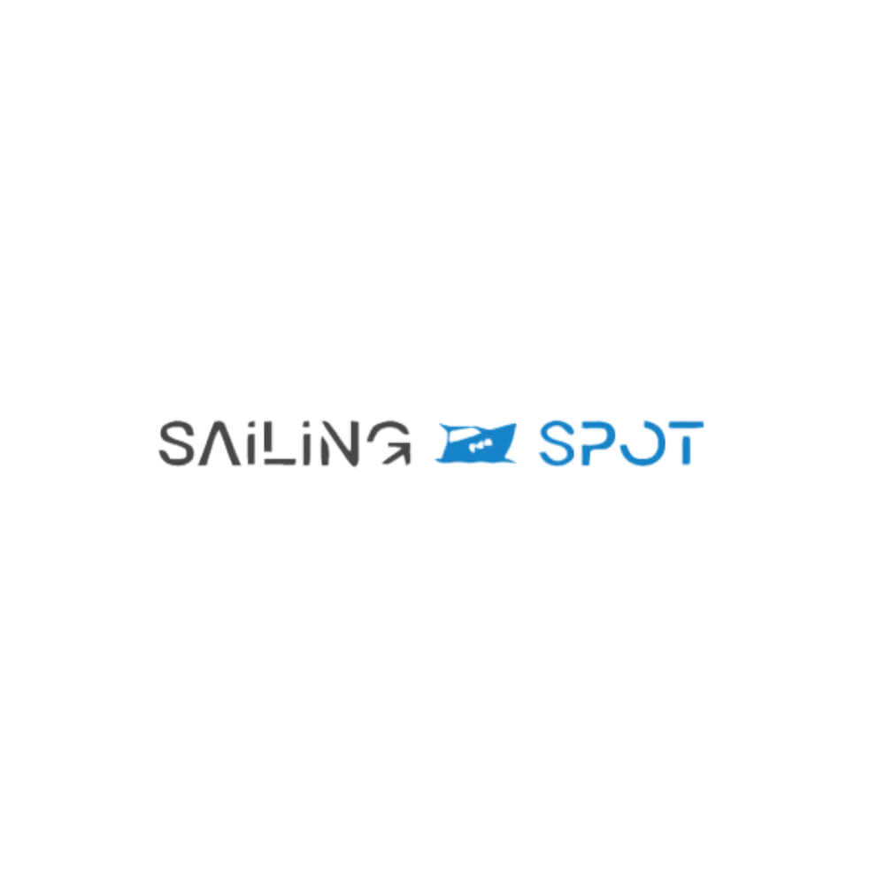

<a name="readme-top"></a>


<div align="center">
  <!-- You are encouraged to replace this logo with your own! Otherwise you can also remove it. -->

  
  <br/>

  <h3><b>SailingSpot</b></h3>

</div>

<!-- TABLE OF CONTENTS -->

# 📗 Table of Contents

- [📗 Table of Contents](#-table-of-contents)
- [📖 \[Sailing\_Spot\] ](#-sailing_spot-)
  - [🛠 Built With ](#-built-with-)
    - [Tech Stack ](#tech-stack-)
    - [Key Features ](#key-features-)
  - [🚀 Live Demo ](#-live-demo-)
  - [💻 Getting Started ](#-getting-started-)
    - [Prerequisites](#prerequisites)
    - [Setup](#setup)
    - [Install](#install)
    - [Usage](#usage)
  - [👥 Authors ](#-authors-)
  - [🔭 Future Features ](#-future-features-)
  - [🤝 Contributing ](#-contributing-)
  - [⭐️ Show your support ](#️-show-your-support-)
  - [🙏 Acknowledgments ](#-acknowledgments-)
  - [❓ FAQ (OPTIONAL) ](#-faq-optional-)
  - [📝 License ](#-license-)

<!-- PROJECT DESCRIPTION -->

# 📖 [Sailing_Spot] <a name="about-project"></a>


**[Sailing_Spot]** is a...

## 🛠 Built With <a name="built-with"></a>

### Tech Stack <a name="tech-stack"></a>

<details>
  <summary>React</summary>
  <ul>
    <li><a href="https://reactjs.org/">React.js</a></li>
  </ul>
</details>

<details>
  <summary>Ruby on Rails</summary>
  <ul>
    <li><a href="https://rubyonrails.org/">Ruby on Rails</a></li>
  </ul>
</details>

<details>
<summary>Database</summary>
  <ul>
    <li><a href="https://www.postgresql.org/">PostgreSQL</a></li>
  </ul>
</details>

<details>
<summary>Webpack</summary>
  <ul>
    <li><a href="https://webpack.js.org/">Webpack</a></li>
  </ul>
</details>

<!-- Features -->

### Key Features <a name="key-features"></a>

- **[key_feature_1]**
- **[key_feature_2]**
- **[key_feature_3]**

<p align="right">(<a href="#readme-top">back to top</a>)</p>

<!-- LIVE DEMO -->

## 🚀 Live Demo <a name="live-demo"></a>

> Add a link to your deployed project.

- [Incomming..](https://google.com)

<p align="right">(<a href="#readme-top">back to top</a>)</p>

<!-- GETTING STARTED -->

## 💻 Getting Started <a name="getting-started"></a>

To get a local copy up and running, follow these steps.

### Prerequisites

In order to run this project you need:

### Setup

Clone this repository to your desired folder:


```sh
  cd my-folder
  git clone git@github.com:CakeInTech/SailingSpot.git
```

### Install

Install this project with:

```sh
  cd SailingSpot
  bundle install
  yarn install
```

### Usage

To run the project, execute the following command:

```sh
  ./bin/dev
```

or

```sh
  rails assets:precompile
  rails server
```


<p align="right">(<a href="#readme-top">back to top</a>)</p>

<!-- AUTHORS -->

## 👥 Authors <a name="authors"></a>
<br>

👤 **Mohamed Ibrahim**

- GitHub: [@CakeInTech](https://github.com/CakeInTech)
- LinkedIn: [Mohamed Ibrahim](https://www.linkedin.com/in/cakeintech/)

👤 **Md Tariq-ul Islam**

- [GitHub](https://github.com/developertariq)
- [Twitter](https://twitter.com/developer_tariq)
- [LinkedIn](https://www.linkedin.com/in/developer-tariq/)

👤 **Newton Alumasa**

- [altontonn](https://github.com/altontonn/)
- [AlumasaNewton](https://twitter.com/AlumasaNewton)
- [newton-alumasa](https://www.linkedin.com/in/newton-alumasa/)

👤 **Chimezie Asouzu**

- GitHub: [@Shegy28](https://github.com/shegy28)
- Twitter: [@Shegy28](https://twitter.com/twitterhandle)
- LinkedIn: [LinkedIn](https://www.linkedin.com/in/chimezie-asouzu-67704224a/)

<p align="right">(<a href="#readme-top">back to top</a>)</p>

<!-- FUTURE FEATURES -->

## 🔭 Future Features <a name="future-features"></a>

- [ ] **[new_feature_1]**
- [ ] **[new_feature_2]**
- [ ] **[new_feature_3]**

<p align="right">(<a href="#readme-top">back to top</a>)</p>

<!-- CONTRIBUTING -->

## 🤝 Contributing <a name="contributing"></a>

Contributions, issues, and feature requests are welcome!

Feel free to check the [issues page](../../issues/).

<p align="right">(<a href="#readme-top">back to top</a>)</p>

<!-- SUPPORT -->

## ⭐️ Show your support <a name="support"></a>


If you like this project...

<p align="right">(<a href="#readme-top">back to top</a>)</p>

<!-- ACKNOWLEDGEMENTS -->

## 🙏 Acknowledgments <a name="acknowledgements"></a>

I would like to thank...

<p align="right">(<a href="#readme-top">back to top</a>)</p>

<!-- FAQ (optional) -->

## ❓ FAQ (OPTIONAL) <a name="faq"></a>
- **[Question_1]**

  - [Answer_1]

- **[Question_2]**

  - [Answer_2]

<p align="right">(<a href="#readme-top">back to top</a>)</p>

<!-- LICENSE -->

## 📝 License <a name="license"></a>

This project is [MIT](./LICENSE) licensed.

_NOTE: we recommend using the [MIT license](https://choosealicense.com/licenses/mit/) - you can set it up quickly by [using templates available on GitHub](https://docs.github.com/en/communities/setting-up-your-project-for-healthy-contributions/adding-a-license-to-a-repository). You can also use [any other license](https://choosealicense.com/licenses/) if you wish._

<p align="right">(<a href="#readme-top">back to top</a>)</p>
